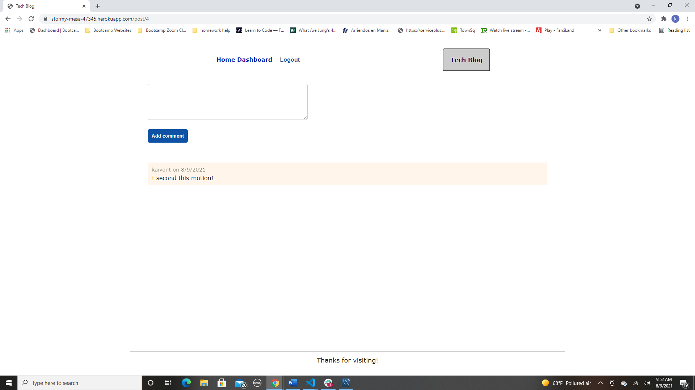

# Tech-Blog# Progressive-Budget

Visit the Deployed Site Offered by Herokua:

https://stormy-mesa-47345.herokuapp.com/

# Description

This is an official tech blog website! You can go and post a blog, see other users blogs, comment on them, edit and delete yours! 

# How To Use

Really simple to use. Signup with a simple username and password and you can write your first blog post today! 

# Technology Used

- Node.js
- MySql
- Javascript
- Heroku
- CSS
- Express
- Handlebars
- Sequelize
- JawsDB

# Contact

Any questions or concerns about this app, please contact me:

Github: https://github.com/kaivont85
Email: kaivont@gmail.com

# Screenshots 

Landing Page

Login/Signup

Home Section To See All Blogs

User Dashboard to Make Blogs And Edit/Delete

Posting comments on a specific blog after clicking on it

